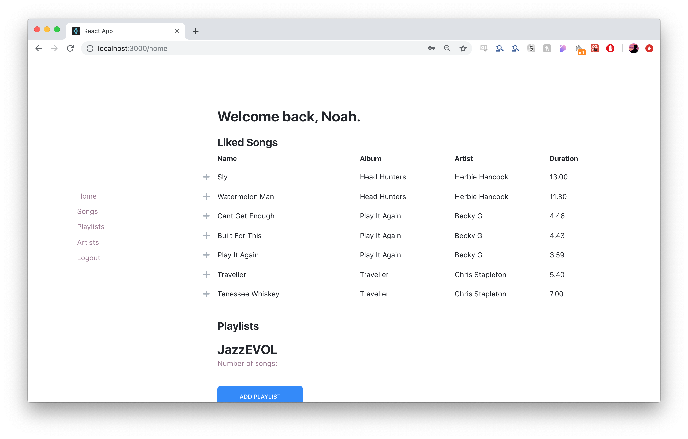

# Music App



This is a music streaming app built for the final project of CPSC 304. It allows users to browse and follow artists, like songs and create playlists. This repository holds the **front-end** code for the project.

## Getting Started

### Prerequisites

Make sure you have Node.js and NPM installed. First clone this repo:

```
$ git clone https://github.com/narendrasss/music.git
```

Then clone the repo for the server:

```
$ git clone https://github.com/narendrasss/music-server.git
```

The server assumes there is an instance of PostgreSQL running in the background. I used the steps laid out in [this article](https://blog.logrocket.com/setting-up-a-restful-api-with-node-js-and-postgresql-d96d6fc892d8) to setup postgres.

Then you need to create a `config.js` file at the root directory of the server, with the following contents:

```js
export const connectionOptions = {
  user: ...,
  host: ...,
  database: ...,
  password: ...,
  port: ...
};
```

If you followed the steps of the tutorial in the article above, the following config would work:

```js
export const connectionOptions = {
  user: 'me',
  host: 'localhost',
  database: 'api',
  password: 'password',
  port: 5432
};
```

### Installing

Run npm install on both the server and client side code. For example, if you have the server code in the `music-server` directory and the client code in the `music` directory, you would run:

```
$ cd music-server && npm install
$ cd music && npm install
```

### Running the Dev Server

Then run `npm start` for the server, then the client. For example, if you have the server code in the `music-server` directory and the client code in the `music` directory, you would run:

```
$ cd music-server && npm start
$ cd music && npm start
```

You can then navigate to `localhost:3000` to view the app.

## Acknowledgements

Thanks to group members Frederic Alexandre Hayek and Parth Garg for helping in the project, mainly with:

- Database idea, schema design, and example entries
- Design of SQL queries
